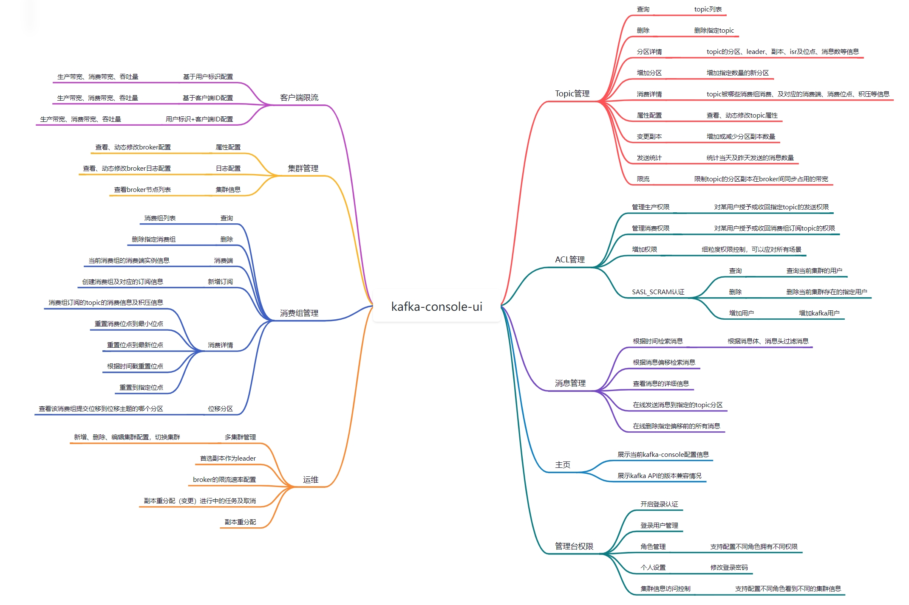

# kafka可视化管理平台
一款轻量级的kafka可视化管理平台，安装配置快捷、简单易用。  
为了开发的省事，没有国际化支持，只支持中文展示。  
用过rocketmq-console吧，对，前端展示风格跟那个有点类似。

## 页面预览
如果github能查看图片的话，可以点击[查看菜单页面](./document/overview/概览.md)，查看每个页面的样子
## 集群迁移支持说明
当前主分支及日后版本不再提供消息同步、集群迁移的解决方案，如有需要，查看：[集群迁移说明](./document/datasync/集群迁移.md)
## ACL说明
acl配置说明，如果kafka集群启用了ACL，但是控制台没看到Acl菜单，可以查看：[Acl配置启用说明](./document/acl/Acl.md)
## 功能支持
* 多集群支持
* 集群信息
* Topic管理
* 消费组管理
* 消息管理
* ACL
* 运维

功能明细看这个脑图：


## 安装包下载
点击下载(v1.0.4版本)：[kafka-console-ui.zip](https://github.com/xxd763795151/kafka-console-ui/releases/download/v1.0.4/kafka-console-ui.zip)

## 快速使用
### Windows
1. 解压缩zip安装包  
2. 进入bin目录（必须在bin目录下），双击执行`start.bat`启动
3. 停止：直接关闭启动的命令行窗口即可

### Linux或Mac OS
```
# 解压缩
unzip kafka-console-ui.zip
# 进入解压缩后的目录
cd kafka-console-ui
# 启动
sh bin/start.sh
# 停止
sh bin/shutdown.sh
```

### 访问地址
启动完成，访问：http://127.0.0.1:7766

### 配置集群
第一次启动，打开浏览器后，因为还没有配置kafka集群信息，所以页面右上角可能会有错误信息，比如：No Cluster Info或者是没有集群信息，请先切换集群之类的提示。  

集群配置如下：
1. 点击页面上方导航栏的 [运维] 菜单
2. 点击集群管理下的 [集群切换] 按钮
3. 在弹框里点击 [新增集群]
4. 然后输入kafka集群地址和一个名称（随便起个名字）
5. 点击提交便增加成功了
6. 增加成功可以看到会话框已经有这个集群信息，然后点击右侧的 [切换] 按钮，便切换该集群为当前集群  

后续如果再增加其它集群，就可以按上面这个流程，如果想切换到哪个集群，点击切换按钮，便会切换到对应的集群，页面的右上角会显示当前是使用的哪个集群，如果不确定，可以刷新下页面。

在新增集群的时候，除了集群地址还可以输入集群的其它属性配置，比如请求超时，ACL配置等。如果开启了ACL，切换到该集群的时候，导航栏上便会出现ACL菜单，支持进行相关操作（目前是基于SASL_SCRAM认证授权管理支持的最完善，其它的我也没验证过，虽然是我开发的，但是我也没具体全部验证这一块功能，授权部分应该是通用的）

## kafka版本
* 当前使用的kafka 2.8.0
## 监控
仅提供运维管理功能，监控、告警需要配合其它组件，如有需要，建议请查看：https://blog.csdn.net/x763795151/article/details/119705372

## 源码打包
如果想通过源码打包，查看：[源码打包说明](./document/package/源码打包.md)

## 本地开发
如果需要本地开发，开发环境配置查看：[本地开发](./document/develop/开发配置.md)

## 联系方式
+ 微信群
  

+ 若联系方式失效, 请联系加一下微信, 说明意图
    - xxd763795151
    - wxid_7jy2ezljvebt12